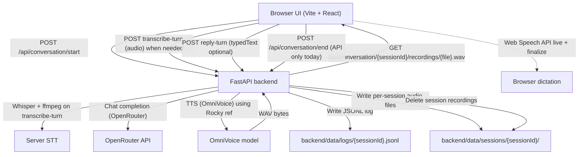

# PRD: OmniVoice chat (Rocky)

## Goal

- Provide a web app where you can have a back-and-forth conversation with a single voice persona (“Rocky”).
- Let the user speak (microphone recording) or type; Rocky responds with both text and synthesized speech (voice cloned from a reference clip).
- Keep per-turn audio during an active conversation where applicable; server stores conversation logs under `backend/data/` (see backend `POST /api/conversation/end` for optional cleanup of session files while retaining JSONL logs).

## Rocky persona and speech style

- **LLM**: `Rocky/Rocky-Life.md` and `Rocky/Rocky-Speech-Style.md` are read by the backend and appended to Rocky’s system prompt (when each file is non-empty), under “Backstory and personality” and “How Rocky writes and speaks (dialogue)”. Invariant rules (concise replies, no meta-policy leakage) stay in code.
- **Reload**: Content is cached by file `mtime`; saving a markdown file picks up changes on the next turn without restarting uvicorn.
- **Size**: Per-file content is capped for prompt size (default 12000 characters); set `ROCKY_PROMPT_MAX_CHARS` in `backend/.env` to raise the cap.
- **TTS**: Rocky uses OmniVoice clone (`ref_audio`, `ref_text`) plus an optional short `instruct` string on the Rocky `Voice` definition for extra style hinting alongside the clone.

## Screens and implemented features

### Rocky conversation (single screen)

- **Purpose**: Run a single-session conversation with Rocky, showing the transcript and allowing playback/download of per-turn audio when URLs exist.
- **Entry points**: App root (`frontend/src/main.tsx` renders `frontend/src/App.tsx`).

### Session lifecycle

- **Start**: The client calls `POST /api/conversation/start` via `ensureSessionId()` the first time the user records or sends a message; there is **no** separate “Start conversation” control in the current UI.
- **End**: The backend exposes `POST /api/conversation/end` (delete session recordings, keep JSONL). The **current React UI does not surface** an “End conversation” button; session data otherwise accumulates until redeploy or manual cleanup outside the app.

### User input: microphone + dictation

- **Media**: **Start / stop** mic uses `MediaRecorder` with `audio/webm`. **While recording**, a **trash** control discards the take (stops recorder, aborts dictation, clears composer state).
- **Visual feedback**: During **recording** or **arming** the mic (waiting on `getUserMedia`), the mic control uses a **slow red blink**; the trash icon appears only while recording.
- **Web Speech (dictation)**:
  - **`SpeechRecognition` / `webkitSpeechRecognition`** runs in **parallel** with the recorder. **`rec.start()`** runs **synchronously on the mic tap** (before any `await`) so Chromium keeps user-gesture semantics for dictation.
  - **Live transcript** streams into the composer via `dictationLiveText` and `onTranscript` (`frontend/src/speechDictation.ts`), including robust reading of `item(0)` vs indexed alternatives. **`react-dom` `flushSync`** is used so interim text paints reliably.
  - **`isArmingMic`**: true between tap and successful `MediaRecorder.start`; composer is read-only with placeholder “Listening…”. **Send** during arming shows a short “wait for mic” status instead of acting.
  - **Default language**: `navigator.language` with fallback `en-US`. Dictation is **not** guaranteed offline; privacy and quality depend on the browser/OS engine.
- **Stop mic (does not send)**: Stopping the mic finalizes the blob, runs `finishAndGetTranscript()`, merges server dictation + live buffer into **`typedText`**, stores the clip in **pending** blob / object-URL refs for optional **Play** on send, and shows **“Review the text, then tap send when you’re ready.”** Short clips are rejected with an error status.
- **Typing placeholders**: After stop, **“Finishing on-device dictation”** may show briefly (`awaitingDictationWrapup`). **“Transcribing on the server”** shows only when **`transcribe-turn`** runs (see send paths below).

### User input: send and typed composer

- **Send** posts turns using `frontend/src/conversationApi.ts`:
  - **With non-empty text** (typed or merged after mic stop): `POST /api/conversation/reply-turn` with `typedText`. If a **pending recording** exists, the user bubble gets the **blob `audioUrl`** for local playback while the server log for typed turns may omit `user_audio` (expected tradeoff).
  - **With empty text but pending audio** (no dictation text): `POST /api/conversation/transcribe-turn` then `POST /api/conversation/reply-turn` without `typedText` (Whisper path).
- **Send while still recording**: Automatically **stops the mic** (same finalize path as stop), then continues send with merged text and pending audio as above.
- **Enter** in the composer submits the same as **Send**, except during **arming** (blocked).
- **Optimistic UI**: When sending **with text**, the **user speech bubble** is appended **immediately** with the outgoing text (and optional local recording URL). **`reply-turn`** then updates that user line if the server returns different `userText`, appends **Rocky’s** bubble, and runs autoplay. On **`reply-turn` failure**, the optimistic **user** row is **removed** and the error is shown in the status line.
- **Rocky typing**: **`awaitingRocky`** shows Rocky’s typing bubble until the reply request finishes.

### Transcript display

- Messages show **role** (`user` / `rocky`) and **turn** index.
- **User text** comes from the optimistic string, dictation merge, Whisper `userText`, or server-echoed `userText` on `reply-turn`.

### Audio playback and downloads

- Rocky rows: **Play** / **Download** for server WAV URLs.
- User rows: **Play** / **Download** when `audioUrl` is present (typically `blob:` from the pending clip after a mic capture).
- **Autoplay**: UI primes with a short silent WAV then attempts one Rocky play per turn (best-effort; browser policies may block).

### Error handling

- Client surfaces backend error strings when present.
- Common failures: missing **`OPENROUTER_API_KEY`**, missing **`ffmpeg`** on the server when **Whisper** runs, OmniVoice / CUDA / memory issues on small hosts.

## Open questions (from code inspection)

- **Autoplay**: Best-effort only; not fully verified across all browsers.
- **`audio/webm`**: Not all browsers support this `MediaRecorder` MIME type.
- **Dictation**: Web Speech coverage and quality vary; Whisper fallback remains required. **Embedded or non-standard browsers** (for example some in-IDE browsers) may not expose speech APIs; **desktop Safari and Chrome** are the tested happy path.
- **End session UX**: Exposing `POST /api/conversation/end` in the UI is a possible follow-up.

## Technical architecture

### Frontend

- Stack: **Vite + React** (`frontend/package.json`).
- Dev: Vite proxy **`/api` → `http://localhost:8001`** (`frontend/vite.config.ts`); production builds use **same-origin** `/api` when the API serves the SPA (see **Hosting**).
- Main UI: `frontend/src/App.tsx`.
- API: `frontend/src/conversationApi.ts` (`start`, `transcribe-turn`, `reply-turn`).
- Dictation helper: `frontend/src/speechDictation.ts`.

### Backend

- Stack: **FastAPI** (`backend/app/main.py`).
- **Optional static SPA**: If **`FRONTEND_DIST`** points at a directory (for example the Vite `dist` copied in Docker), the app mounts **`StaticFiles(..., html=True)`** at `/` so one process serves UI + API.
- **Session storage**: `backend/data/sessions/{sessionId}/`, logs in `backend/data/logs/{sessionId}.jsonl` (runtime data; not committed to git by default).
- **STT**: Whisper in `transcribe_user_audio_turn` / `stt.py`; requires **`ffmpeg`** on the host when Whisper runs.
- **LLM**: OpenRouter (`llm.py`, `OPENROUTER_MODEL`, `OPENROUTER_API_KEY`).
- **TTS**: OmniVoice (`tts.py`, `voices.py`).

### Hosting (Railway and Docker)

- **`Dockerfile`**, **`railway.toml`**, and **`RAILWAY.md`** at the repo root describe a **single-service** image: build frontend, install Python deps + CPU **torch**, serve with **uvicorn** on **`PORT`**.
- **`README.md`** links to **`RAILWAY.md`** for operator steps. **`backend/data`** is gitignored; attach a volume on Railway if you need persistence across deploys.
